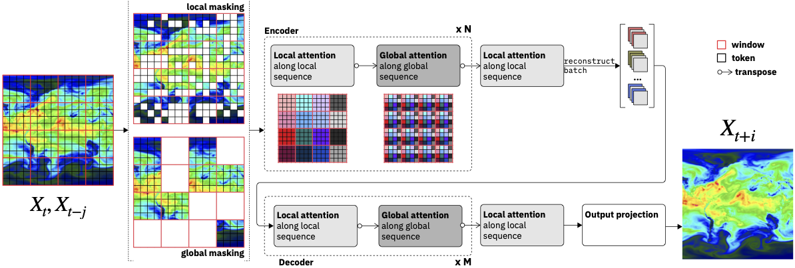

# Prithvi WxC: Foundation model for weather and climate

This repository contains the code of the Prithvi WxC foundation model as well as a basic zero-shot examples for testing and illustration. For fine-tuning applications please refer to task-specific repositories listed [below](https://github.com/NASA-IMPACT/Prithvi-WxC?tab=readme-ov-file#fine-tuning-applications).

## Updates

### March 25, 2025

The previous version of this repo contained a number of bugs that led to incorrect model outputs and worse performance than in our paper. We just addressed these issues. In particular, there is validation code below that lets you verify whether your particular platform and version of the code obtains results comparable to ours. (See step 3 under [Getting started](#getting-started).)

## Architecture overview: A scalable and flexible vision transformer

Prithvi WxC, a scalable 2D vision transformer inspired by Hiera, overcomes architectural limitations to handle non-rectangular data topologies. It leverages a pretraining strategy with attention and fine-tuning with convolutions, drawing from both Hiera and MaxViT approaches.

Our data, structured into windows, takes the shape (batch, windows, tokens, features). We alternate between **local attention** (within a window) and **global attention** (across windows), akin to modulo masking. This is implemented by transposing dimensions between transformer layers. Attention acts on the third dimension, the second being part of the batch. Masking can target entire windows or individual tokens, the latter disrupting global connections between the same token across windows. See the figure for illustration:




## Fine-tuning applications

We have fine-tuned the model to a number of downstream tasks. See the paper as well as the respective repository for details.

| Application                  | Dataset     | Repository                         |
| ---------------------------- | ----------- | ---------------------------------- |
| Downscaling                  | MERRA-2     | https://github.com/IBM/granite-wxc |
|                              | EURO-CORDEX | https://github.com/IBM/granite-wxc |
| Gravity wave parametrization | ERA5        | https://github.com/NASA-IMPACT/gravity-wave-finetuning |

Beyond these there are zero-shot applications in masked reconstruction and forecasting.

## Getting started

1. Create a virtual environment
2. Clone this repository and install Prithvi WxC as a module
   ```
   git clone https://github.com/NASA-IMPACT/Prithvi-WxC
   cd Prithvi-WxC
   pip install '.[examples]'
   ```
3. Validate that the model behaves as expected. For that run
   ```
   python -m validation.validate_prithvi_wxc -c validation/config.yaml
   ```
4. Run one of the notebooks in the `examples` directory:
   - [Basic inference](examples/PrithviWxC_inference.ipynb)
   - [Rollout inference](examples/PrithviWxC_rollout.ipynb)
   
   These notebooks will download model weights as well as sample data for basic illustration from [Hugging Face](https://huggingface.co/Prithvi-WxC).

## Pretrained models

Prithvi WxC is a very flexible model. It has been pretrained on a pretext task blending masked reconstruction and forecasting so that it can be used for both zero-hours ahead as well as forecasting applications. Moreover, the masking pattern makes it suitable for both global and regional applications. There are currently two pretrained base models as well as several [fine-tuning applications](https://github.com/NASA-IMPACT/Prithvi-WxC?tab=readme-ov-file#fine-tuning-applications).

| Model                        | Details                                                                                                   | Weights                                                 |
| ---------------------------- | --------------------------------------------------------------------------------------------------------- | ------------------------------------------------------- |
| prithvi.wxc.2300m.v1         | Pretrained 2.3B parameter model. Flexible input and lead time. For general and 0-hour ahead applications. | https://huggingface.co/Prithvi-WxC/prithvi.wxc.2300m.v1 |
| prithvi.wxc.rollout.2300m.v1 | Pretrained 2.3B parameter model. Input and lead time fixed to 6h. For forecasting applications.           | https://huggingface.co/Prithvi-WxC/prithvi.wxc.rollout.2300m.v1 |


## Data

Prithvi WxC used data from the MERRA-2 reanalysis for pretraining. In particular, the model uses a climatology computed from MERRA-2 data. The climatology, too, is [available via Hugging Face](https://huggingface.co/Prithvi-WxC/prithvi.wxc.2300m.v1/tree/main/climatology). See the paper for details on variables choosen and the methodology behind the climatology.


## Citation
If you use this work, consider citing our paper

```
@misc{schmude2024prithviwxcfoundationmodel,
      title={Prithvi WxC: Foundation Model for Weather and Climate}, 
      author={Johannes Schmude and Sujit Roy and Will Trojak and Johannes Jakubik and Daniel Salles Civitarese and Shraddha Singh and Julian Kuehnert and Kumar Ankur and Aman Gupta and Christopher E Phillips and Romeo Kienzler and Daniela Szwarcman and Vishal Gaur and Rajat Shinde and Rohit Lal and Arlindo Da Silva and Jorge Luis Guevara Diaz and Anne Jones and Simon Pfreundschuh and Amy Lin and Aditi Sheshadri and Udaysankar Nair and Valentine Anantharaj and Hendrik Hamann and Campbell Watson and Manil Maskey and Tsengdar J Lee and Juan Bernabe Moreno and Rahul Ramachandran},
      year={2024},
      eprint={2409.13598},
      archivePrefix={arXiv},
      primaryClass={cs.LG},
      url={https://arxiv.org/abs/2409.13598}, 
}
```
